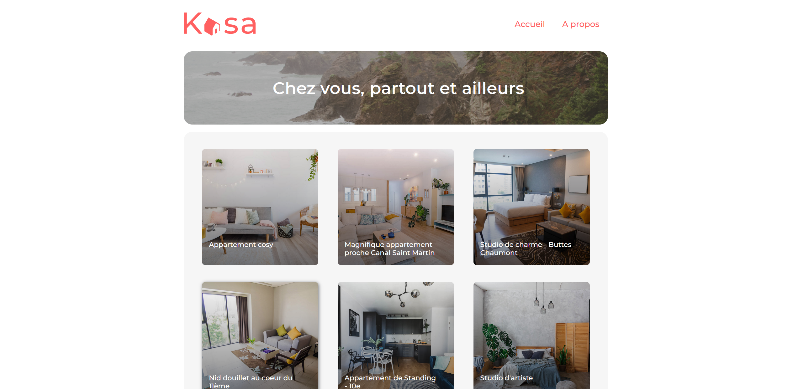

# Kasa

languages : React | html/css | sass

description : Développement de la partie front-end du site "Kasa" avec React.js et CRA

- Configurer la navigation entre les pages de l'application avec React Router
- Développer des éléments de l'interface d'un site web grâce à des composants React
- Initialiser une application avec Create React App

  
